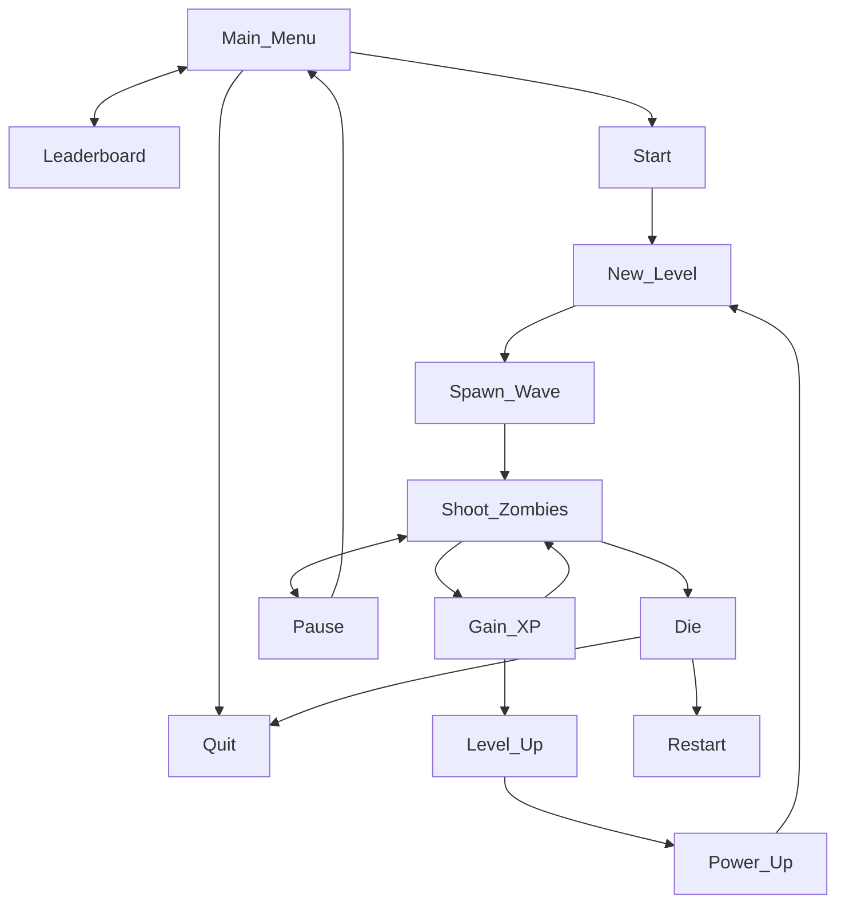
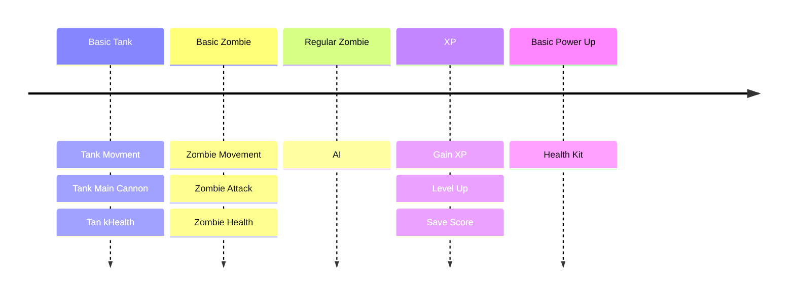
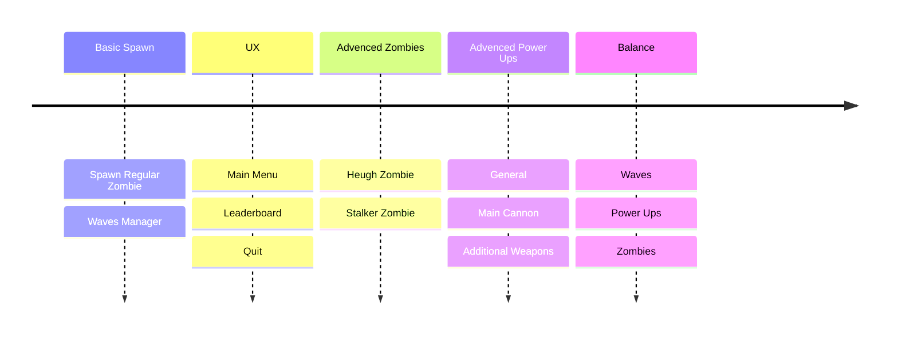

# Unreal Challenge

## Prompt

**Create a spooky auto-shooter (horror themed) type of game in Unreal Engine.**

The assignment has these minimum requirements:

- Players can only **control the character's movement**. Weapons should **shoot automatically**.
- Player starts with one default auto-shooting weapon.
- Have 3 different enemy types which get introduced gradually, more types are optional. The enemies have to be differentiated by graphics and
amount of health. More differentiation (like mechanics) are optional.
- Game gets progressively harder.
- Player has a health bar and can take a few hits before dying.
- Enemies drop experience, which the player can pick up.
- When the player levels up, they can choose from a selection of
power-ups. Have 3 different power-ups, more is optional. Power-ups can
be anything, like new auto-shooting weapons, upgrades to them, upgrades
to the player themselves, one-off effects, etc.
- The game saves the highest score between sessions.
- You're allowed to use Quixel Megascans or Unreal Marketplace assets as
long as they're assets only (no code or Blueprint functionality).
- Cite your sources in your code comments if you use code/methods from elsewhere.

## Design

### Character

- Tank.
- Can move forward and backwards and rotate left / right.
- Has a turret  than can rotate left or right [**optional:** control elevation].

### Camera

- Camera is a follow camera with a pan option for a slighter far view.
- Camera position should be high enough to allow the player notice upcoming hordes of zombies.

### Controls

- Controls are WASD for controlling the tank body, and mouse for controlling turret rotation.
- Other UI menus and popups will be controlled via the mouse.

### Game Loop

### Enemies

- The tank enemies are 3 types of zombies.
- Regular zombie [health: 20, damage: 10, speed: regular]
    - Mechanic: walking towards the player location, and upon entering FOV switch to running.
- Stalker zombie [health: 10, damage: 5, speed: fast]
    - Mechanic: Trying to sneak towards the player location from an angle outside of the player FOV, after getting close enough, start running towards the player.
- Hugh zombie [health: 40, damage: 20, speed: slow]
    - Mechanic: Brut force.
- Zombies [hugh zombie excluded] can be ran over by the tank, while applying minimal damage [2].

### Power Ups

- General power ups:
    - Health kit.
    - Higher speed.
    - Armor.
- Main cannon power ups:
    - Burst shoot.
    - Higher fire rate.
    - Larger damage radius.
- Additional Weapons:
    - Multi barrel rocket launcher (hive attack).
    - Mines.

### Level Design

- Pre defined map.
- As levels are progressed, there are more enemy spawner from various types.
- As levels are progressed, the duration between spawn waves is getting shorter.

## Project Management

